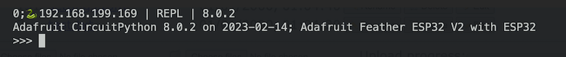

WEB WORKFLOW SETUP FOR ADAFRUIT ESP32 FEATHER V2
================================================

This is a guide to setting up a web workflow for the Adafruit ESP32 Feather V2. It is based on the [Adafruit Setup Webflow Guide](https://learn.adafruit.com/circuitpython-with-esp32-quick-start/setting-up-web-workflow).

Connect to REPL:
```bash
minicom -D /dev/cu.wchusbserial5479048475
```

Setup up Wifi connection with the following code in the REPL
```python
f = open('settings.toml', 'w')
f.write('CIRCUITPY_WIFI_SSID = "Loxodonta"\n')
f.write('CIRCUITPY_WIFI_PASSWORD = "Twitch7%Carton%Driller%Bluish"\n')
f.write('CIRCUITPY_WEB_API_PASSWORD = "prodyna"\n')
f.close()
```

Hit 'Reset' button

When connecting with the REPL again you should see the IP address:
Screenshot of REPL with connected IP: 


Connect with a browser to the corresponding IP (e.g. http://192.168.199.169/fs/).
Use the password from above and leave the username empty.

To disable webflow: rename the settings.toml
```python
import os
os.rename ('settings.toml', 'settings.disabled')
```

# Reenableing Webflow
Start in safe mode, get a REPL and rename the file back to `settings.toml` then reset.
```python
import os
os.rename ('settings.disabled', 'settings.toml')
```
Note
- When reenableing the webflow, you will have the file browser unless you have any bugs in the code `code.py` will run as well.
- To start in safe mode 'reset' and hold the 'boot' button when the led is blinking yellow. 